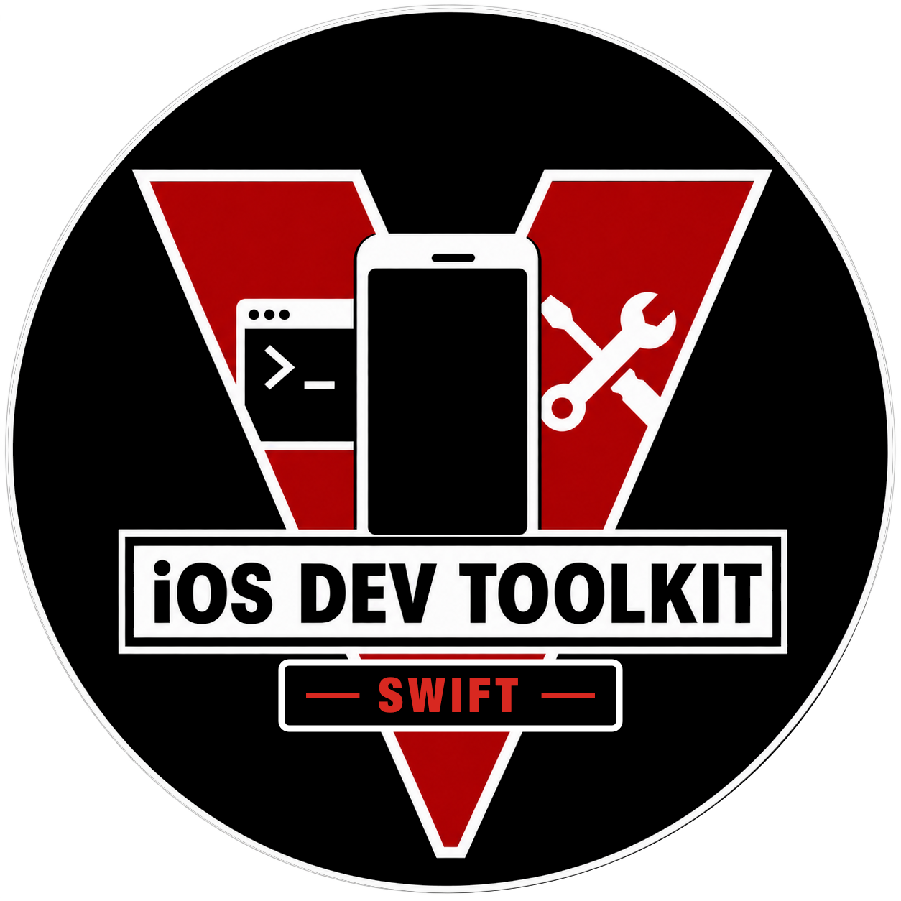

# iOS Developer Toolkit (Swift)

<p align="center">
  
</p>

**A native macOS app for working with iPhones, iPads, and simulators — device information, live logs, location simulation, app installs, backups, packet capture, readiness checks, and documented evidence collection.**

[](https://github.com/hideouts-io/iOS-Developer-Toolkit-Swift/actions/workflows/ci.yml)
[](https://github.com/hideouts-io/iOS-Developer-Toolkit-Swift/releases/latest)


[](LICENSE)


iOS Developer Toolkit is written in Swift and SwiftUI. It talks to devices through macOS's own
device service (usbmuxd and lockdown), Xcode's CoreDevice service (`devicectl`), `simctl`, and
Instruments. It needs no Python, no Homebrew packages, and no administrator rights.

> **Scope.** This is a tool for devices you own or are authorized to examine. It does not
> jailbreak iOS, bypass a passcode, disable the sandbox, defeat code signing, decrypt protected
> traffic, or provide unrestricted file-system access.

## Contents

- [What it does](#what-it-does)
- [Screenshots](#screenshots)
- [Requirements](#requirements)
- [Install](#install)
- [First steps](#first-steps)
- [Workspaces](#workspaces)
- [Developer images](#developer-images)
- [Command-line tool](#command-line-tool)
- [Security and privacy](#security-and-privacy)
- [Troubleshooting](#troubleshooting)
- [Build from source](#build-from-source)
- [Project status and limitations](#project-status-and-limitations)
- [Contributing, support, and license](#contributing-support-and-license)

## What it does

| Area | What you get |
|---|---|
| **Devices** | Automatic discovery of USB and Wi-Fi–synced devices (event-driven, no polling), Xcode-paired network devices, and simulators — shown in separate *Physical Devices* and *Simulators* sections. |
| **Plain-language device details** | Name, model, hardware identifier, UDID, iOS version and build, architecture, connection, trust, Developer Mode, and developer-service status, each with an explanation. Identifying values stay hidden until you choose to show them. |
| **Readiness Check** | A read-only check of every prerequisite (Xcode, the macOS device service, connection, trust, Developer Mode, Xcode's device service, developer services, Instruments, lock state, logging and backup services, Safari Web Inspector) with a next step for anything not ready. |
| **Live Logs** | Unified Logging and classic syslog streamed from physical devices, and the simulator's unified log; plus two collected sources: an **OSLog archive** (the device's saved log history for a time window, kept as a `.logarchive` for Console) and **DVT logging** (os_log recorded through Instruments, kept as a `.trace`). Every byte is spooled and hashed; the view can be paused and filtered (literal or regex) without affecting capture. Mark findings, then export the raw capture, filtered lines, or an evidence bundle. |
| **Location Lab** | Set a coordinate (offline world map, map-link parsing, nudges, saved places), move along a route at constant speed, or replay a GPX track. Always clearable; every change is logged. |
| **Apps** | Search and sort installed apps (with sizes over USB), launch, and remove with confirmation. |
| **Install App** | Inspect an `.ipa` on the Mac first — contents, provisioning profile, and code signature verified with Security.framework — then install it on a device, or install an `.app` on a simulator. |
| **Actions** | Over 40 guided actions (diagnostics, battery, IORegistry, provisioning and configuration profiles, crash reports, screenshots, sysdiagnose, Instruments recordings, packet capture, Bluetooth capture, Safari and web view tabs, network discovery, launch, open URL, simulated location, restart, simulator controls), each showing its risk, what it needs, and exactly how it runs. An Advanced Mode runs `devicectl` subcommands bound to the selected device. |
| **Backup** | Encrypted local backups with the same protocol Finder uses, full or incremental, with progress. Turn on backup encryption with a new password (never stored or logged). |
| **Evidence Capture** | A documented case folder with snapshots, optional timed streams (Unified Logs, syslog, packet capture), a screenshot, and crash reports, plus a manifest and SHA-256 hashes. Failed steps are recorded as coverage gaps. |
| **Packet capture** | Device-side network packets written as a standard `.pcap` file for Wireshark or tcpdump, as an action or as part of Evidence Capture. |
| **External tools** | Optional handoffs to separately installed [MVT](https://github.com/mvt-project/mvt), [UFADE](https://github.com/prosch88/UFADE), and [idb Companion](https://github.com/facebook/idb), validated by path and SHA-256. |
| **Session Activity** | Everything run in this session, with exportable manifests (output hashes, never raw output). |
| **Tool Reference** | The exact help text of the installed `devicectl`, `simctl`, and `xctrace`, and a Toolchain Check that confirms every command the app relies on exists in your Xcode. |

## Screenshots

The demo screenshots use the built-in **Demo Mode** (a clearly labelled simulated iPhone) or a
real iOS simulator. They contain no real device data.

| Readiness Check | Device details (simulator) |
|---|---|
| [](docs/screenshots/readiness-check.png) | [](docs/screenshots/device-simulator.png) |

| Live Logs (simulator) | Location Lab |
|---|---|
| [](docs/screenshots/live-logs.png) | [](docs/screenshots/location-lab.png) |

| Actions | Apps |
|---|---|
| [](docs/screenshots/actions.png) | [](docs/screenshots/apps.png) |

| Backup | Evidence Capture |
|---|---|
| [](docs/screenshots/backup.png) | [](docs/screenshots/evidence-capture.png) |

More: [Install App](docs/screenshots/install-app.png) · [External Tools](docs/screenshots/external-tools.png) · [Scope & Safety](docs/screenshots/scope-and-safety.png)

## Requirements

| | |
|---|---|
| **macOS** | macOS 14 Sonoma or later. |
| **Mac** | Apple silicon or Intel (universal binary). Tested on Apple silicon. |
| **Devices** | iPhone and iPad (iOS/iPadOS). Developer-service features on physical devices need iOS 17 or later through Xcode's device service; iOS 16 and earlier are supported for identity, logs, backups, diagnostics, and apps. |
| **Simulators** | Any iOS simulator installed with Xcode. |
| **Connection** | A data-capable USB cable, or Wi-Fi sync / Xcode network pairing after first pairing over USB. |
| **Xcode** | Optional — see below. |

### What needs Xcode

Many features use only macOS's built-in device service and work on a Mac **without Xcode**.
Features that use Xcode's developer tools need Xcode installed (open it once to finish setup):

| Works without Xcode | Needs Xcode |
|---|---|
| Device discovery (USB and Wi-Fi sync), identity, trust, Developer Mode status | Simulators (everything in the Simulators section) |
| Live Logs from physical devices (Unified and classic syslog) | Location simulation on iOS 17 and later |
| Packet capture; Bluetooth capture (with Apple's logging profile); Safari and web view tab listing (with Web Inspector on); checking the developer image, and mounting it over USB from an image Xcode installed or a folder you choose ([Developer images](#developer-images)) | Xcode's device service (`devicectl`) route for the developer image |
| Encrypted backups and encryption setup | Screenshots, launch app, open URL, stop a process |
| Diagnostics, battery, IORegistry, MobileGestalt, running processes, configuration profiles | Lock state, displays |
| Installed apps (with sizes), removing apps, installing `.ipa` packages | Sysdiagnose and Instruments recordings |
| Provisioning profiles, crash reports, Media folder listing | Restart device, Advanced Mode (`devicectl`), Tool Reference |
| IPA inspection, Evidence Capture (without the Xcode-only steps) | Readiness rows for Xcode's device service and Instruments |

The Command Line Tools alone are not enough for the Xcode column: `devicectl`, `simctl`, and
`xctrace` ship with Xcode.app.

## Install

### Download a release

1. Download `iOS-Developer-Toolkit-Swift-VERSION-macOS-universal.zip` and `SHA256SUMS.txt` from the
   [latest release](https://github.com/hideouts-io/iOS-Developer-Toolkit-Swift/releases/latest).
2. Verify the download:

   ```bash
   shasum -a 256 -c SHA256SUMS.txt --ignore-missing
   ```

   Optionally verify GitHub's build attestation:

   ```bash
   gh attestation verify iOS-Developer-Toolkit-Swift-VERSION-macOS-universal.zip --repo hideouts-io/iOS-Developer-Toolkit-Swift
   ```

3. Unzip it and move **iOS Developer Toolkit (Swift).app** to `/Applications`.
4. Release builds are ad-hoc signed and not notarized, so macOS asks for confirmation the first
   time. Control-click the app, choose **Open**, and confirm. If there is no Open button, go to
   **System Settings › Privacy & Security** and choose **Open Anyway**. Do not disable Gatekeeper.

Nothing else needs to be installed. The release also contains `idt`, the command-line tool, at
`iOS Developer Toolkit (Swift).app/Contents/MacOS/idt`.

### Build it yourself

See [Build from source](#build-from-source).

## First steps

1. **Connect and trust.** Connect the iPhone or iPad with a USB cable, unlock it, and tap
   **Trust**. Enter the passcode on the device — never in this app.
2. **Choose the target.** Use the device menu at the left of the toolbar. Physical devices and
   simulators are listed separately, and every page shows which one it acts on.
3. **Run the Readiness Check.** It tells you exactly what works and what to fix next.
4. **Turn on Developer Mode if needed** (iOS 16+): *Settings › Privacy & Security › Developer
   Mode*, then restart and confirm. **Device › Developer Mode Guide** walks through it.
5. **Mount the developer image** for screenshots, location simulation, and launching apps: the
   **Developer Image** page (in the sidebar, under Device) shows its state; click **Mount Developer Image**.
   See [Developer images](#developer-images).
6. **Clean up** when finished: stop streams and clear simulated locations. Quitting the app
   clears a location this session simulated.

No device handy? Turn on **Device › Demo Mode** to explore every workspace with a simulated iPhone.

## Workspaces

- **Overview** — status of the selected device, a suggested next step, and entry points.
- **Device** — identity and status with explanations, a summary of the developer image, Apple developer tool handoffs (open a project in Xcode, open an `.xcresult` or
  `.trace`, list Remote Virtual Interfaces), simulator controls, raw records, and connection
  diagnostics.
- **Developer Image** — the developer image on the selected device (state, details, mount,
  unmount), how to mount it (automatic, Xcode's device service, or the built-in client), the
  images on this Mac and folders you add, and what is mounted on the device.
- **Readiness Check** — the read-only prerequisite check, a copyable report, and a local history
  of tested devices that can be exported as sanitized JSON or Markdown.
- **Apps** — installed apps with search, sort, sizes, launch, and confirmed removal.
- **Install App** — inspect an `.ipa` (or choose a simulator `.app`), see whether the device is in
  the provisioning profile, then install.
- **Location Lab** — coordinates, map, saved places (stored only on this Mac), routes, GPX playback.
  Location events are appended to `~/Documents/iOS Developer Toolkit (Swift) Location Logs/location-events.jsonl`.
- **Live Logs** — several concurrent streams; pop out any stream into its own window.
- **Actions** — the guided action catalog and Advanced Mode.
- **Backup** — encryption status and setup, full or incremental backups.
- **Evidence Capture** — optional guided case intake (title, purpose, authorization), collection,
  and a summary of every step.
- **External Tools** — MVT, UFADE, and idb Companion.
- **Session Activity**, **Tool Reference**, **Scope & Safety** — history, built-in tool help, and
  the app's boundaries.

Press **⌘K** for the command palette, **⌘R** to refresh devices, **⇧⌘R** to run the Readiness
Check, **⌘1–⌘9** to switch workspaces, and **⌥⌘←** / **⌥⌘→** for the previous or next
workspace. **Help › Keyboard Shortcuts** (**⌘/**) lists them all.

### How changes are confirmed

| Risk | Example | Confirmation |
|---|---|---|
| Read-only | Battery snapshot, lock state | Runs immediately |
| Saves files on this Mac | Screenshot, crash reports, backup | Review sheet; files are never overwritten |
| Changes the device | Launch app, set location, install | Type `RUN` plus the last six characters of the device's UDID |
| High impact | Restart device, remove an app, erase a simulator | Also confirm a current backup and type `IRREVERSIBLE` plus the same code |

Because the code comes from the target's UDID, a confirmation can never apply to a different
device. Each operation also captures its target when it starts, and lockdown sessions verify
that the device answering is the one you selected.

## Developer images

Screenshots, location simulation, launching apps, and Instruments need Apple's developer image
(Developer Disk Image) mounted on the device. The **Developer Image** page (sidebar, under Device)
checks it automatically and shows one of these states; the Device page shows a summary:

[](docs/screenshots/developer-image.png)


| State | Meaning |
|---|---|
| Mounted | A compatible image is mounted. Nothing is mounted again. |
| Available | A compatible image is on this Mac and can be mounted now (the device already holds Apple's personalization for it, or it is an iOS 16-or-earlier image). |
| Personalization required | A compatible image is on this Mac; Apple must sign it for this device first (iOS 17 and later, needs the internet). |
| Missing | No compatible image is on this Mac. |
| Incompatible | The image on this Mac (or the one mounted) does not fit this device or iOS version. |
| Needs attention | Trust, Developer Mode, unlocking, or a USB connection is needed first. |
| Failed | The check or the last mount attempt failed; the card shows why and what to do. |
| Not required | Simulators and the demo device. |

The details list the iOS version and build, model, architecture, chip and board used to choose the
image, where it is mounted, and which image on this Mac would be used.

**iOS 17 and later** use a *personalized* image. Xcode installs it in
`/Library/Developer/DeveloperDiskImages/iOS_DDI`. Mounting picks the build identity for the
device's chip and board and, unless the device already holds a personalization for that image,
asks Apple's signing server (`gs.apple.com`) for one — sending the device's chip, board, and ECID
with a one-time nonce, exactly as Xcode does. The confirmation says so before anything is sent.

**iOS 16 and earlier** use `DeveloperDiskImage.dmg` and its `.signature` for the exact iOS
`major.minor` version. Current Xcode versions no longer include them; add a folder that contains
them (for example an older Xcode's `Platforms/iPhoneOS.platform/DeviceSupport/16.4`) with
**Add Image Folder…** on the Developer Image page.

**How it mounts** (Developer Image › How to mount): *Automatic* uses Xcode's device service (`devicectl`)
when it can reach the device on iOS 17 and later, and otherwise the built-in client, which talks
to the device's image-mounter service over USB and works without Xcode's device service. The app
never downloads images from third parties.

## Command-line tool

`idt` provides the automation-friendly parts of the app:

```bash
idt devices --simulators                      # list devices and simulators
idt readiness --udid <UDID>                   # read-only readiness check
idt inspect-ipa App.ipa [--json]              # inspect a package
idt collect --udid <UDID> --output-root ~/Cases --duration 120 --include-unified-logs
idt ddi status --udid <UDID> [--json]         # developer image state (exit 0 mounted, 2 mountable)
idt ddi mount --udid <UDID> --confirm "RUN ABC123" [--mechanism automatic|core-device|native]
idt ddi unmount --udid <UDID> --confirm "RUN ABC123"
idt toolchain                                 # check the installed Xcode
```

`--include-oslog-archive` adds the device's saved Unified Log history for the last hour (`log collect`); `--include-dvt-logs` records os_log through Instruments (DVT) for the stream duration. `--include-oslog`, the 0.3.x flag for the DVT OSLog stream, is still accepted and selects DVT logging.

`idt collect` exits with `0` when complete, `2` when finished with coverage gaps, and `1` when the
device could not be identified.

## Security and privacy

- **Least privilege.** No administrator rights and no `sudo`. The app never reads
  `/var/db/lockdown`, never creates pairing records, and never restarts system services. Pairing
  material is requested from macOS's device service and kept only in memory.
- **Verified connections.** Lockdown sessions use TLS with this Mac's pairing certificate, pin the
  device certificate from the pairing record, and confirm the device's UDID before any request.
- **No shell.** External tools run from fixed paths with an argument vector and a minimal
  environment; nothing is interpreted by a shell. All process launches go through one audited
  runner with timeouts and cancellation.
- **Untrusted input.** Device responses, backup file paths, IPA archives, GPX files, and workspace
  profiles are validated; path traversal, symbolic links, encrypted or oversized archive entries,
  and XML entities are rejected.
- **Local only.** Nothing is uploaded, with one confirmed exception: mounting a developer image on
  iOS 17 and later asks Apple's signing server (`gs.apple.com`) to personalize it, sending the
  device's chip, board, and ECID with a one-time nonce — as Xcode does. Captures, backups, cases, and reports are written with
  owner-only permissions. The app's own log records outcomes rather than device content, and marks
  identifiers as private.
- **Sanitized sharing.** **iOS Developer Toolkit › Create Support Bundle…** and the readiness
  report exports remove names, identifiers, paths, and addresses. Review them before sharing.
- **Hardened runtime**, no App Sandbox: the app must reach the system's device service socket and
  run Xcode's tools. See [SECURITY.md](SECURITY.md) to report a vulnerability.

## Troubleshooting

| Problem | Try this |
|---|---|
| The device does not appear | Use a data cable, unlock the device, tap **Trust**, try another port, and check **Connection diagnostics** on the Device page. If nothing appears after reconnecting, restart the Mac. |
| “This device has not trusted this Mac” | Unlock the device and reconnect it; tap **Trust**. If no prompt appears, reset *Settings › General › Transfer or Reset › Reset › Reset Location & Privacy*. |
| Developer Mode is missing on the device | Connect it and open Xcode › *Window › Devices and Simulators* once. |
| Developer features say they need Xcode | Install Xcode, open it once, and check *Xcode › Settings › Locations › Command Line Tools*. |
| The developer image will not mount | Read the Developer Image page: it names the problem (Developer Mode, lock, missing or incompatible image) and the fix. On iOS 17 and later keep the Mac online (Apple personalizes the image); if one route fails, switch **How to mount** on the Developer Image page. |
| A backup stops with “must stay unlocked” | Unlock the device and keep it awake until the backup finishes. |
| An `.ipa` cannot be installed | Check the inspection: the signature must be valid and the profile must include the device. |
| Live logs are very busy | Filter the view or pause it; capture continues in the background. |
| Something else | Run the **Readiness Check**, then create a support bundle and open a discussion. |

More detail: [docs/troubleshooting.md](docs/troubleshooting.md).

## Build from source

Requirements: macOS 14+, Xcode 16 or later (Swift 6).

```bash
git clone https://github.com/hideouts-io/iOS-Developer-Toolkit-Swift.git
cd iOS-Developer-Toolkit

swift test                                    # unit and integration tests
swift build -c release --product idt          # the command-line tool

xcodebuild -project iOSDeveloperToolkit.xcodeproj -scheme iOSDeveloperToolkit \
  -configuration Release -destination 'platform=macOS' build

scripts/build-release.sh                      # universal, ad-hoc-signed release ZIP, SBOM, checksums in build-output/release/
```

The Xcode project is generated from `project.yml` with [XcodeGen](https://github.com/yonaskolb/XcodeGen)
and committed, so you only need XcodeGen when you change the project structure (`xcodegen generate`).

Optional test suites:

```bash
IDT_SIMULATOR_TESTS=1 swift test --filter RealSimulator   # boots a simulator end to end
xcodebuild -project iOSDeveloperToolkit.xcodeproj -scheme iOSDeveloperToolkit \
  -destination 'platform=macOS' test                      # UI tests (macOS asks to allow automation)
```

Documentation screenshots are produced by the app itself:

```bash
"iOS Developer Toolkit (Swift).app/Contents/MacOS/iOS Developer Toolkit (Swift)" \
  -demo-mode YES -populate-demo YES -window-size 1180x700 -capture-screenshots ~/Desktop/shots
```

Layout: `Sources/ToolkitCore` (process runner, errors, logging, secure files),
`Sources/DeviceKit` (usbmuxd, lockdown and its services, CoreDevice, simctl, discovery),
`Sources/ToolkitFeatures` (Location Lab, IPA inspection, logs, actions, readiness, evidence,
external tools), `Sources/idt` (CLI), `App/` (SwiftUI app and UI tests), `Tests/`.
See [docs/architecture.md](docs/architecture.md).

## Project status and limitations

Version 1.0 is a native rewrite of the Python/PySide6 app ([iOS Developer Toolkit](https://github.com/hideouts-io/iOS-Developer-Toolkit), 0.3.x), which depends on
`pymobiledevice3`. See [MIGRATION.md](MIGRATION.md) for the feature-by-feature mapping. Workspace
profiles exported by 0.3.x can be imported in **Settings › Profiles**; the preview explains how each
setting carries over.

### The Python app

The Python/PySide6 app, **iOS Developer Toolkit**, is maintained separately in
[hideouts-io/iOS-Developer-Toolkit](https://github.com/hideouts-io/iOS-Developer-Toolkit), with its releases. It uses `pymobiledevice3` and
Python; this app needs neither. The two install side by side and keep their data in separate
folders, and this app imports workspace profiles exported by the Python app.

- The native lockdown services (logs, packet capture, backup, diagnostics, app installation over
  USB, developer-image checking and mounting including Apple personalization) are tested end to
  end against a protocol-accurate simulated device and against macOS's real device service. Their
  read-only protocol layer has been checked on one iPhone (iOS 26, Developer Mode off); mounting,
  location, installation, backup, and the app's pages **have not yet been tested on physical
  iPhones or iPads**. Please report results using the
  [physical-device test protocol](docs/PHYSICAL_DEVICE_TEST_PROTOCOL.md).
- Not available in 1.0: the developer-service file listing. Details and alternatives are in [MIGRATION.md](MIGRATION.md#6-known-limitations-and-features-not-reproduced).
- Release builds are ad-hoc signed and not notarized.
- Release builds are universal (Apple silicon and Intel). If the Intel half is run under Rosetta on
  an Apple silicon Mac, macOS warns that the app includes a component that will not open in
  macOS 28; the Apple silicon half, which runs by default, is not affected.

## Contributing, support, and license

- [CONTRIBUTING.md](CONTRIBUTING.md) — setup, design rules, and checks.
- [SUPPORT.md](SUPPORT.md) — where to ask questions.
- [SECURITY.md](SECURITY.md) — private vulnerability reporting.
- [THIRD_PARTY_NOTICES.md](THIRD_PARTY_NOTICES.md) and [SOURCE_AVAILABILITY.md](SOURCE_AVAILABILITY.md).

iOS Developer Toolkit is released under the [MIT License](LICENSE). The bundled world map uses
public-domain [Natural Earth](https://www.naturalearthdata.com) data. iPhone, iPad, Xcode, and
macOS are trademarks of Apple Inc.; this project is not affiliated with Apple.
